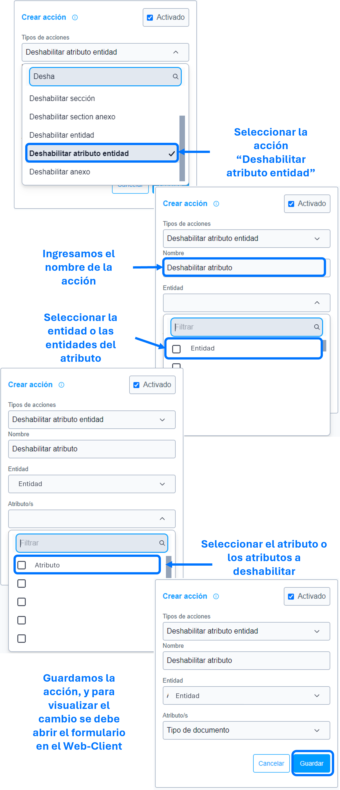

# Deshabilitar atributo entidad

La acción de ``deshabilitar atributo entidad``  se utiliza para deshabilitar, como su nombre indica, el atributo o los atributos especificados en los parámetros de la ``acción``.

### Lista de parámetros:
- Entidad o lista de entidades.
- Atributo o lista de atributos.

## Consideraciones  
- En caso de eliminar el atributo (el cual se parametrizo) se debe actualizar o eliminar dicha acción para evitar el guardado de datos innecesarios. 
  
## Pasos a seguir / Ejemplo
Con los siguientes pasos, lograra deshabilitar el atributo o atributos requeridas.

