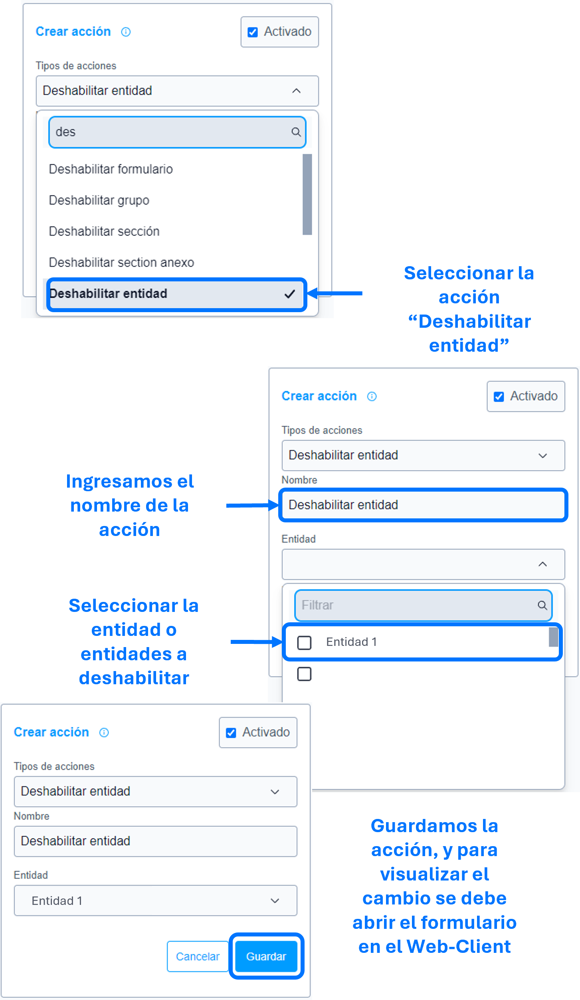

# Deshabilitar entidad

La acción de ``deshabilitar entidad`` se utiliza para deshabilitar los atributos de la entidad o entidades parametrizadas en la acción, impidiendo su diligenciamiento.

### Lista de parámetros:
- Entidad o lista de entidades.

## Consideraciones 
- Los botones acciones, agregar y eliminar, no se les aplicara el deshabilitado, en caso de requerirlo emplear la regla [ocultar botón entidad múltiple]().
  
## Pasos a seguir / Ejemplo
Con los siguientes pasos, lograra deshabilitar la entidad o entidades requeridas.

