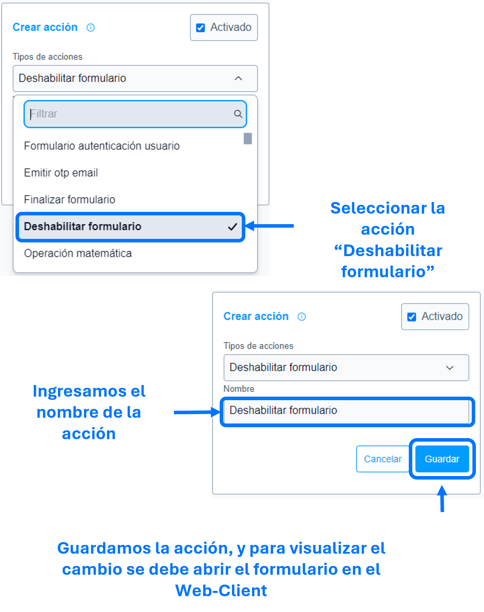

# Deshabilitar formulario

La acción de ``Deshabilitar formulario`` se utiliza para deshabilitar todo el formulario impidiendo su diligenciamiento.

>Importante: Una vez aplicada la acción no es posible reversar la deshabilitación.

## Consideraciones 
- Al deshabilitar el formulario, se deshabilita secciones, entidades, atributos y anexos, impidiendo su dilegenciamiento.
- Los botones acciones, agregar y eliminar, no se les aplicara el deshabilitado,en caso de requerirlo emplear la regla [ocultar botón entidad múltiple]().

## Pasos a seguir / Ejemplo
Con los siguientes pasos, lograra deshabilitar el formulario.

