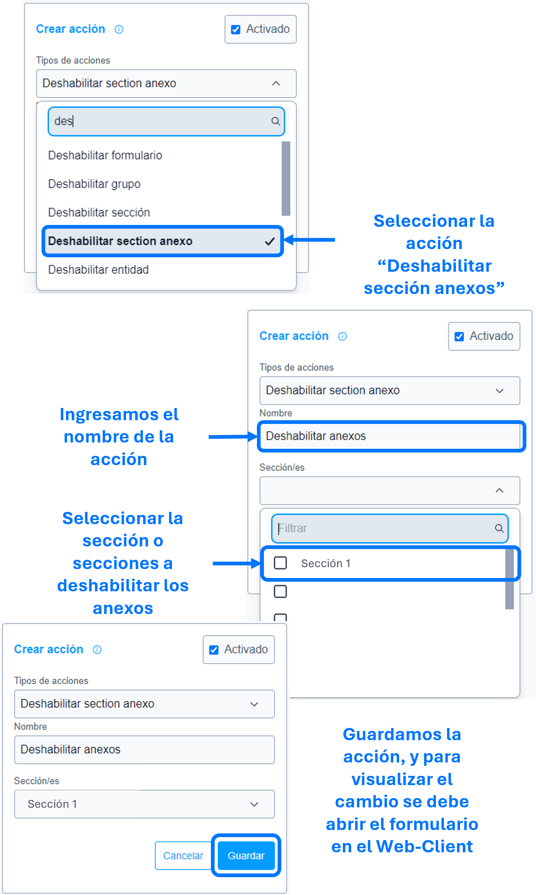

# Deshabilitar sección anexos

La acción de ``Deshabilitar sección anexos`` se utiliza para deshabilitar los anexos relacionados a la sección, impidiendo su diligenciamiento.

>Importante: En caso de deshabilitar los anexos de la primera sección, se requiere crear consecutivamente la acción [validar anexos de sección]().

### Lista de parámetros:
- Sección o lista de secciones.

## Pasos a seguir / Ejemplo
Con los siguientes pasos, lograra deshabilitar los anexos de la sección.

