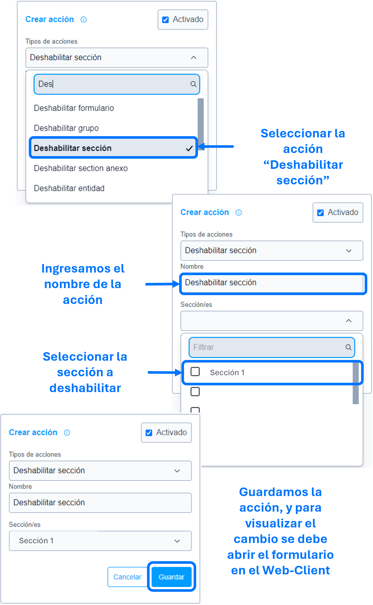

# Deshabilitar sección

La acción de ``Deshabilitar sección`` se utiliza para deshabilitar las entidades y anexos de la sección impidiendo su diligenciamiento.

### Lista de parámetros:
- Sección o lista de secciones.

## Consideraciones 
- Al deshabilitar la sección, se deshabilita, entidades, atributos y anexos, impidiendo su dilegenciamiento.
- Los botones acciones, agregar y eliminar, no se les aplicara el deshabilitado, en caso de requerirlo emplear la regla [ocultar botón entidad múltiple]().

## Pasos a seguir / Ejemplo
Con los siguientes pasos, lograra deshabilitar la sección.

