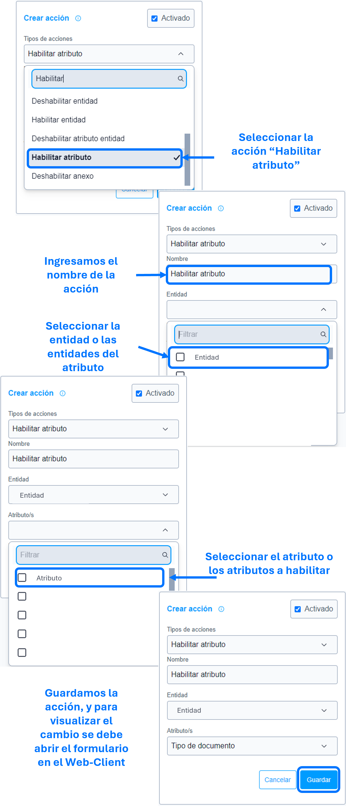

# Habilitar atributo

La acción de ``habilitar atributo`` se utiliza para habilitar, como su nombre indica, el atributo o los atributos especificados en los parámetros de la ``acción``.

### Lista de parámetros:
- Entidad o lista de entidades.
- Atributo o lista de atributos.

## Consideraciones  
- Por defecto SIEMPRE los atributos están habilitados, si no existe la acción [deshabilitar atributo entidad]() esta acción de habilitar no es funcional. 
- En caso de eliminar el atributo (el cual se parametrizo) se debe actualizar o eliminar dicha acción para evitar el guardado de datos innecesarios. 
  
## Pasos a seguir / Ejemplo
Con los siguientes pasos, lograra habilitar el atributo o atributos requeridas.

