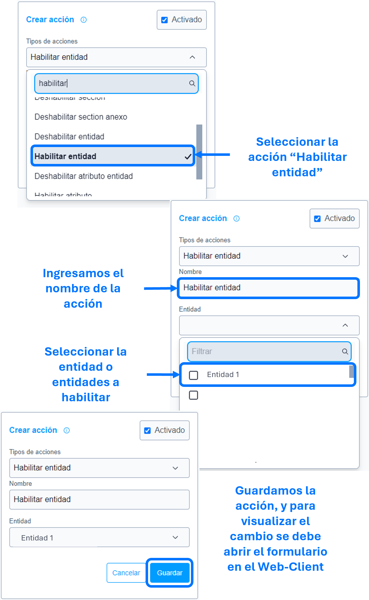

# Habilitar entidad

La acción de ``habilitar entidad`` se utiliza para habilitar los atributos de la entidad o entidades parametrizadas en la acción.

### Lista de parámetros:
- Entidad o lista de entidades.

## Consideraciones 
- Por defecto SIEMPRE las entidades están habilitadas, si no existe la acción [deshabilitar entidad]() esta acción de habilitar no es funcional. 
- Los botones acciones, agregar y eliminar, no se les aplicara el habilitado, en caso de requerirlo emplear la regla [mostrar botón entidad múltiple]().
  
## Pasos a seguir / Ejemplo
Con los siguientes pasos, lograra habilitar la entidad o entidades requeridas.

