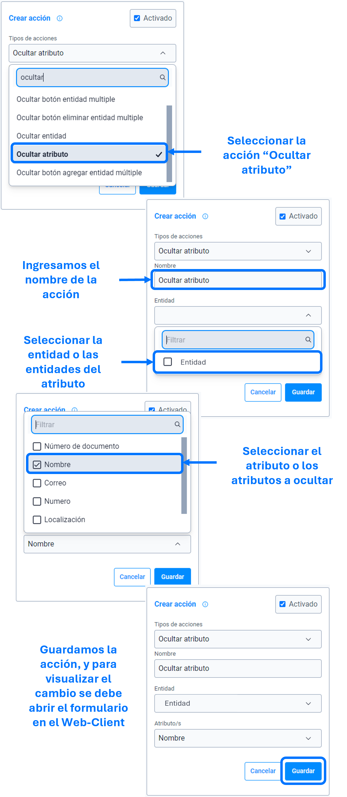

# Ocultar atributo

La acción de ``ocultar atributo`` se utiliza para ocultar, como su nombre indica, el atributo o los atributos especificados en los parámetros de la ``acción``.

>Importante: En caso de que el atributo sea requerido o obligatorio, se debe emplear la acción [deshabilitar entidad atributo](), de lo contrario no sera posible continuar con el diligenciamiento del formulario, ya que impide continuar, hasta que el usuario complete todos los atributos obligatorios.

### Lista de parámetros:
- entidad o lista de entidades, la cual pertenece el atributo o atributos.
- atributo o lista de atributos.

## Consideraciones

- En caso de eliminar el atributo (el cual se parametrizo) se debe actualizar o eliminar dicha acción para evitar el guardado de datos innecesarios. 

## Pasos a seguir / Ejemplo
Con los siguientes pasos, lograra ocultar los atributos que se requieren o sean necesarias.

