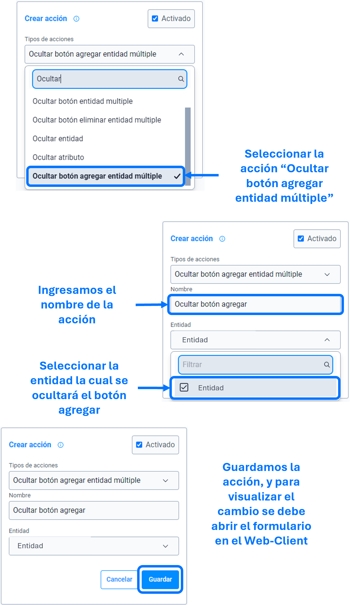

# Ocultar botón agregar entidad múltiple

La acción de ``ocultar botón agregar entidad múltiple`` se utiliza para ocultar, como su nombre indica, el botón con la acción **agregar** de la entidad especificada en los parámetros de la ``acción``.

>Importante: La entidad debe ser multiple de lo contrario no funcionara la acción.

> Si requiere ocultar un botón en especial usar las acciones, [ocultar botón entidad múltiple]() o [ocultar botón eliminar entidad múltiple]().

### Lista de parámetros:
- entidad.

## Consideraciones
- Se debe seleccionar una sola entidad en los parámetros de la acción, de lo contrario no se ejecutara dicha acción (si requiere ocultar el botón **agregar** de varias entidades, por cada entidad se debe crear la acción).
- En caso de eliminar la entidad (la cual se parametrizo) se debe actualizar o eliminar dicha acción para evitar el guardado de datos innecesarios. 

## Pasos a seguir / Ejemplo
Con los siguientes pasos, lograra ocultar el botón con la acción **agregar** de la entidad que se requiere o sea necesaria.

