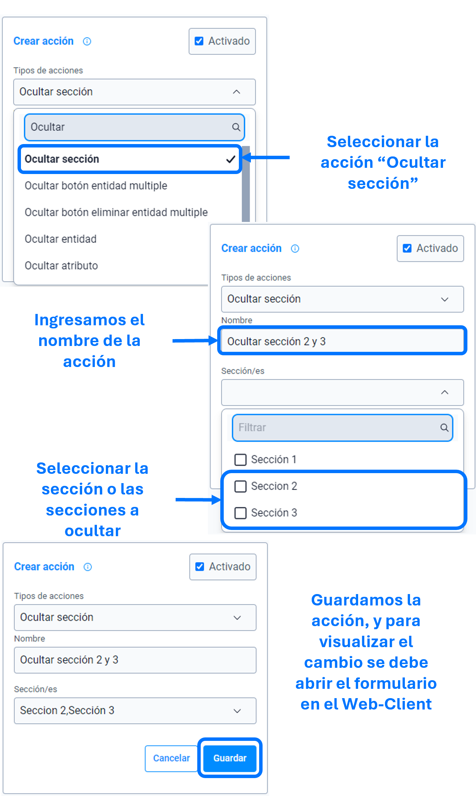

# Ocultar sección

La acción de ``ocultar sección`` se utiliza para ocultar, como su nombre indica, la sección o secciones especificadas en los parámetros de la ``acción``.

>Importante: En caso de ocultar la primera sección, se requiere emplear la acción [activar sección](), de lo contrario al abrir el formulario no sera posible su diligenciamiento.

### Lista de parámetros:
- Sección o lista de secciones.

## Consideraciones
- Al ocultar la sección, los componentes relacionados y sus reglas no se ejecutaran, es decir, que si estos componentes son requeridos, no se realizara dicha validación. 
- Se sugiere que la regla se emplee al cargar el formulario, para evitar problemas de rendimiento.
- En caso de eliminar la sección (la cual se parametrizo) se debe actualizar o eliminar dicha acción para evitar el guardado de datos innecesarios. 

## Pasos a seguir / Ejemplo
Con los siguientes pasos, lograra ocultar las secciones que se requieren o sean necesarias.

