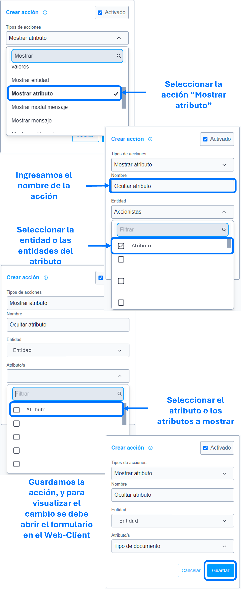

# Mostrar atributo

La acción de ``mostrar atributo`` se utiliza para mostrar, como su nombre indica, el atributo o los atributos especificados en los parámetros de la ``acción``.

>Importante: En caso de que el atributo sea oculto desde la entidad (es decir, oculto por nativo y no por regla), no sera posible cambiar su visualización, se debe cambiar directamente desde la entidad.

### Lista de parámetros:
- Entidad o lista de entidades, la cual pertenece el atributo o atributos.
- Atributo o lista de atributos.

## Consideraciones
- Por defecto SIEMPRE los atributos son visibles, si no existe la acción [ocultar atributo]() esta acción de mostrar no es funcional. 
- En caso de eliminar el atributo (el cual se parametrizo) se debe actualizar o eliminar dicha acción para evitar el guardado de datos innecesarios. 

## Pasos a seguir / Ejemplo
Con los siguientes pasos, lograra mostrar los atributos que se requieren o sean necesarias.

