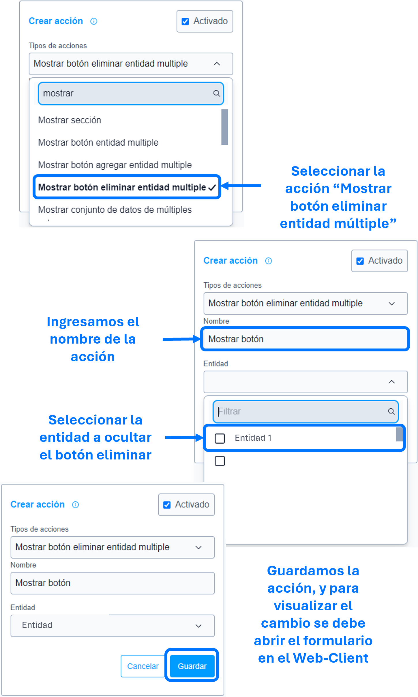

# Mostrar botón eliminar entidad múltiple

La acción de ``mostrar botón eliminar entidad múltiple`` se utiliza para mostrar, como su nombre indica, el botón con la acción **eliminar** de la entidad especificada en los parámetros de la ``acción``.

>Importante: La entidad debe ser multiple de lo contrario no funcionara la acción.

> Si requiere mostrar un botón en especial usar las acciones, [mostrar botón entidad múltiple]() o [mostrar botón agregar entidad múltiple]().

### Lista de parámetros:
- entidad.

## Consideraciones
- Por defecto **SIEMPRE** los botones son visibles, si no existe la acción [ocultar botón eliminar entidad múltiple]() esta acción de mostrar no es funcional.
- Se debe seleccionar una sola entidad en los parámetros de la acción, de lo contrario no se ejecutara dicha acción (si requiere mostrar el botón **eliminar** de varias entidades, por cada entidad se debe crear la acción).
- En caso de eliminar la entidad (la cual se parametrizo) se debe actualizar o eliminar dicha acción para evitar el guardado de datos innecesarios. 

## Pasos a seguir / Ejemplo
Con los siguientes pasos, lograra mostrar el botón con la acción **eliminar** de la entidad que se requiere o sea necesaria.

