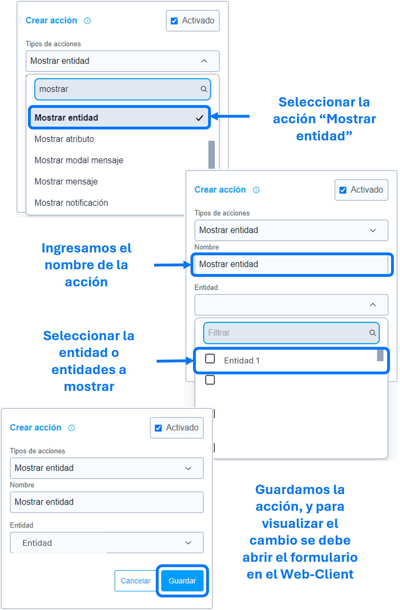

# mostrar entidad

La acción de ``mostrar entidad`` se utiliza para mostrar, como su nombre indica, la entidad o entidades especificadas en los parámetros de la ``acción``.

### Lista de parámetros:
- entidad o lista de entidades.

## Consideraciones

- En caso de eliminar la entidad (la cual se parametrizo) se debe actualizar o eliminar dicha acción para evitar el guardado de datos innecesarios. 

## Pasos a seguir / Ejemplo
Con los siguientes pasos, lograra mostrar las entidades que se requieren o sean necesarias.

