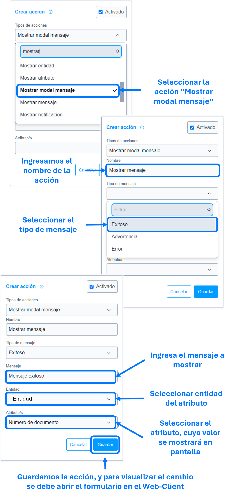

# Mostrar modal mensaje

La acción de ``mostrar modal mensaje`` se utiliza para mostrar, como su nombre indica, un modal informativo en pantalla, con un texto corto, icono y el valor de un atributo, configurables en los parámetros de la ``acción``.

### Lista de parámetros:
- Texto o mensaje en pantalla.
- Tipo de mensaje (Exitoso, advertencia y error).
- Entidad del atributo.
- Atributo cuyo valor se muestra en pantalla.

## Consideraciones

- Tener en cuenta que el atributo parametrizado, se encuentre diligenciado, de lo contrario el valor en pantalla sera vació, indefinido o nulo.
- Se debe seleccionar una sola entidad y atributo en los parámetros de la acción, de lo contrario no se ejecutara correctamente dicha acción.
- En caso de eliminar la entidad o atributo (los cuales se parametrizaron) se debe actualizar o eliminar dicha acción para evitar el guardado de datos innecesarios. 

## Pasos a seguir / Ejemplo
Con los siguientes pasos, lograra mostrar un mensaje en pantalla.

