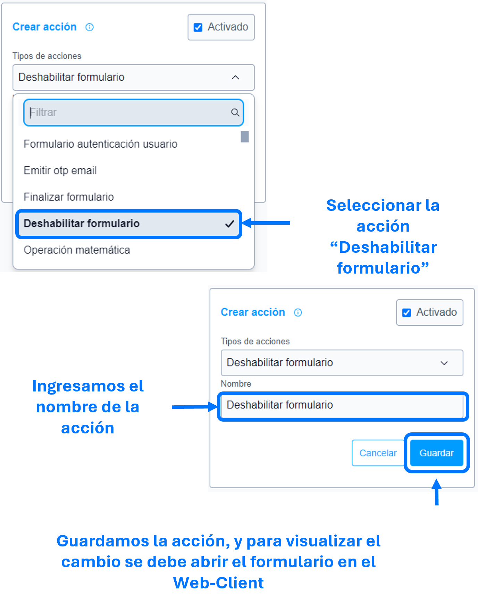

# Mostrar sección

La acción de ``Mostrar sección`` se utiliza para mostrar, como su nombre indica, la sección o secciones especificadas en los parámetros de la ``acción``.

### Lista de parámetros:
- Sección o lista de secciones.

## Consideraciones 
- Por defecto SIEMPRE las secciones son visibles, si no existe la acción [ocultar sección]() esta acción de mostrar no es funcional. 
- Se sugiere que la acción se emplee de forma moderada, para evitar problemas de rendimiento.
- En caso de eliminar la sección (la cual se parametrizo) se debe actualizar o eliminar dicha acción para evitar el guardado de datos innecesarios. 

## Pasos a seguir / Ejemplo
Con los siguientes pasos, lograra mostrar las secciones que se requieren o sean necesarias.

